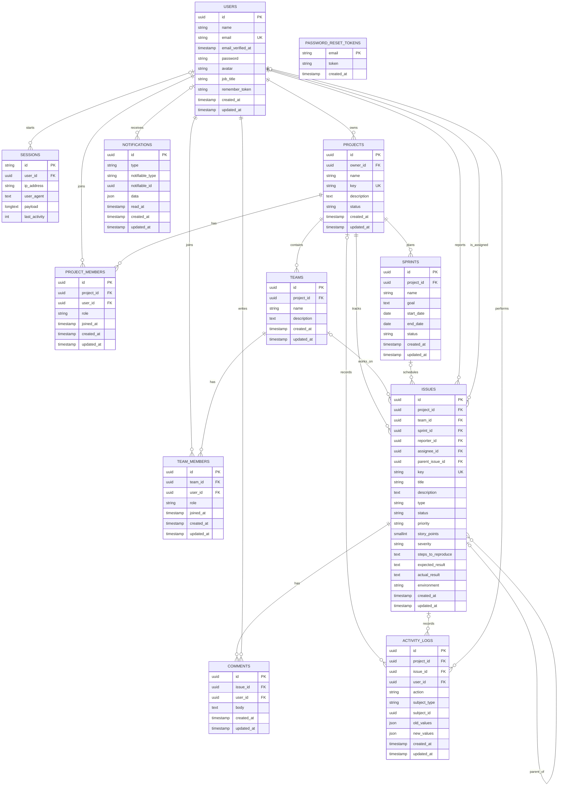

# ScrumLab ER Diagram

This ER diagram is based on the Laravel migrations in `database/migrations` and the Eloquent relationships in `app/Models`.

## Notes

- `project_members` has a composite unique key on `project_id` and `user_id`.
- `team_members` has a composite unique key on `team_id` and `user_id`.
- `teams` has a composite unique key on `project_id` and `name`.
- `issues.team_id`, `issues.sprint_id`, `issues.assignee_id`, and `issues.parent_issue_id` are nullable foreign keys.
- `activity_logs.project_id`, `activity_logs.issue_id`, and `activity_logs.user_id` are nullable foreign keys.
- `notifications.notifiable_type` and `notifications.notifiable_id` are Laravel polymorphic notification columns. The application currently uses user notifications through `App\Models\User`.
- `password_reset_tokens.email` is keyed by email and does not have a database-level foreign key to `users.email`.
